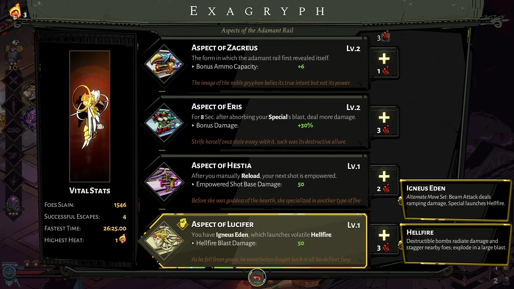
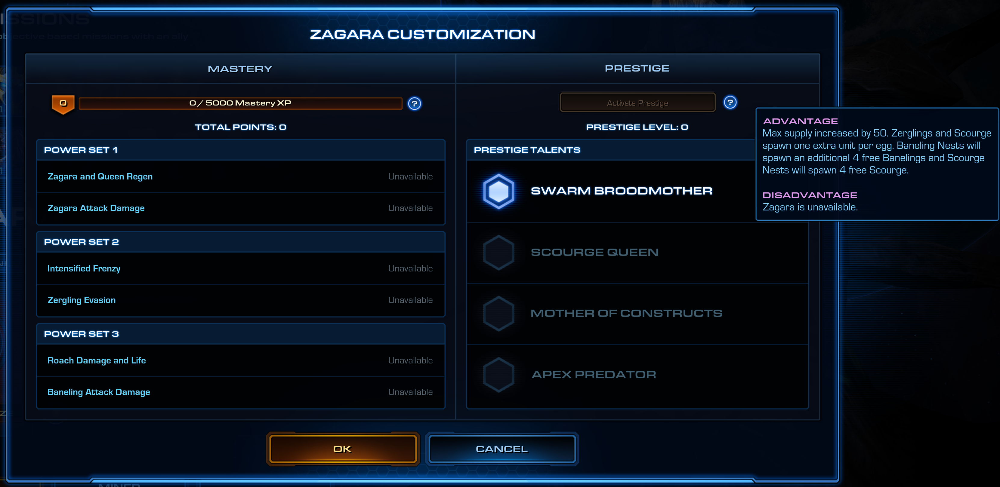

In the modern era, gamers demand their Game Is Balanced. The biggest taboo a popular game can make is when one "tool" or combination turns out to be significantly more potent than others. This has obvious ramifications in competitive multiplayer games. But even for single player games, players get pretty invested in any statistically significant discrepancy in end-results from options that are presented as equals. "Busted"[^busted] and "garbage" are equally unfun for players, even when there isn't a human opponent inflicting this imbalance upon them. 

[^busted]: busted: overpowered, too strong, too obvious a choice for being effective; garbage: underpowered, too weak, too obviously *not* an option for being effective.

## The ROI axis
The simplest balancing equation is the cost-benefit analysis, or "ROI" of employing the tool — where a tool is a unit, item, ability, mechanic, or combination thereof. I like to think of the ROI axis as a multi-variable polynomial equation, where the LHS represents "investment" or costs to the player, and the RHS represents "return" or benefits to their playthrough. Take, for instance an RPG like Diablo or Fallout, and the tool in question is a generic weapon you can buy from a store.

## The object properties term
Generally, there are several costs associated with obtaining such a weapon that you can see when trying to obtain it: the money cost, the weilding stats requirements, encumberance & inventory space taken. On the flip side, you have the stats associated that determine its potency: damage, range, speed, dual-wielding flexibility, stat buffs, target debuffs/elemental properties, and other special abilities. These are the things I think are best balanced with a spreadsheet: items meant to be weak, should be cheap; items meant to be powerful, 'spency.

## The system interaction term
Less obvious — but perhaps more significant — are the costs that manifest from the game's overall design, rather than the tool's stats: how far into the game you have to get to access it, how easily you can reach a shop to access it, or how likely you will get such an item from random loot drops without needing to find a shop.

Similarly, there are also benefits emergent from the game's design, like how many other tools (character classes, weapons, items, or abilities) synergize with it, how many enemies are vulnerable to it, how the evolving challenges scale with the weapon potency as the game progresses from the point of acquiring the weapon. A powerful anti-boss cannon that does 2x the DPS of every other weapon against boss characters, but is significantly weaker than every other weapon of its item tier against "generic" enemies can be considered busted or garbage depending on how hard bosses are compared to generics, or how much of the gameplay time is spent battling bosses vs generics. You can choose to sprinkle a 5-minute boss encounter in every 10-15 minutes, or you can have just one ~15 minute boss battle per major region that takes about ~2 hours to get to.

## The experiential term
What experience do you sacrifice, and what experience do you get to enjoy? Suppose a core feature and *draw* of your game is parkour — chaining movement types to navigate complex environments or quickly reach/avoid enemies — such as in dashes, charge attacks, and teleportation strikes in Hades. Let's say we are considering designing a powerful weapon, with the balance trade-off where it prevents your use of some parkour mechanics in your toolkit like rolling or hanging off an edge. While this design choice has significant terms in the "object properties" and "system interaction" terms, there's something else going on here. You don't get to do something else when you use this weapon. What if this weapon allowed you to fly freely, negating the need to parkour? Well, you still *don't get to parkour*, which was a fun and core mechanic. A strange thing to sacrifice in a *game*! The only way to balance this is to make sure that flight or usage of that weapon is incredibly fun itself.

A typical scenario where this is works is if the new weapon enables exploration of genuinely joyous mechanics/concepts that cannot logically coexist with the mechanics that had to be disabled. However, it's important that all these things tie together thematically/narratively in the scope of the game's premise.

## Spreadsheeting
Spreadsheets for balancing has varying utility. The first term (object properties) is the simplest to apply to a spreadsheet. You can plug in the properties of each tool and assign a weighted scoring function to ensure all the tools are in line with design intent, but it's important to remember this is just one term of the equation. However it gets harder to score the other two terms, especially the experiential term. This stuff can be shoehorned into a spreadsheet, but typically is handled with statistical analysis of numerous playtests and live player stats: look at the success and failure rate, the correlations between adoption and various player performance benchmarks at the intended stages of the game with the given tool and with alternatives, to see that tool efficacy is in line with their intent: tools are effective where they're supposed to be good, tools are weak where they're supposed to be weak, with the correct net trade offs.

## Conclusion
Ultimately, when tuning a game, "players are having a lot of fun" is ultimately (usually) the prime directive, yet can rarely be distilled into numbers. 

Something interesting I learned over the years: asking players "how would you rate your enjoyment" is riddled with all kinds of biases — for example, whenever this is surveyed in popular competitive games, if the player won a match, the 1st percentile (approximate floor) of the ratings is usually around 3/5 stars. However, if the player lost the match, the 99th percentile (approximate ceiling) is also near 3/5 stars. However, when directly monitored during playtests with well-matched sides, the typical enjoyment metrics over the course of the game — indications of investment, flow state, excitement at key interactions and others — is much more similar on both sides (with both having ups and downs with how each interaction goes) until the very end of a match! Given the quality of modern matchmaking algorithms and breadth of playerbase for popular competitive games, the player-provided enjoyment ratings thus are unlikely to be truly representative of the net fun they had. 

Thus it is fairly important to not rely too heavily on spreadsheets and numbers for the final call, even with numbers for surveyed player satisfaction, analytics-based hours played, or player retention — often considered proxies for player satisfaction. What to rely on instead? Observing players in real-time in a playtest lab (or with a screencap + webcam + mic feed if remote) goes a long way to fill the abstract human-emotional-empathic hole that numbers can't provide.

Still, it is hard to say that would be sufficient and this is what makes game design an art form, and not a science. In my personal opinion, having an artistic intention for the journey(s) your game enables players to go on, and tuning the experience to enable that is more important than any number that could go up and to the right.